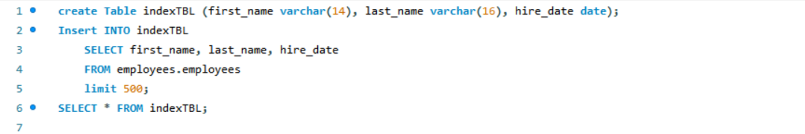
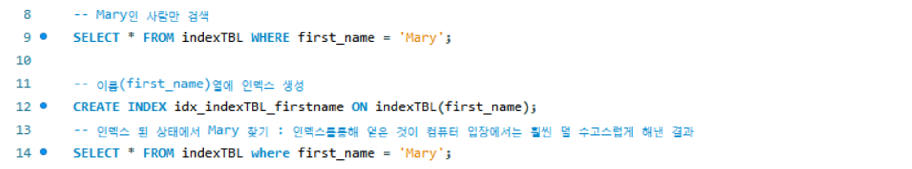
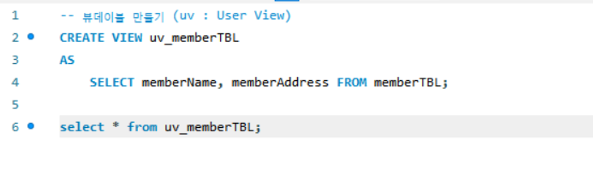
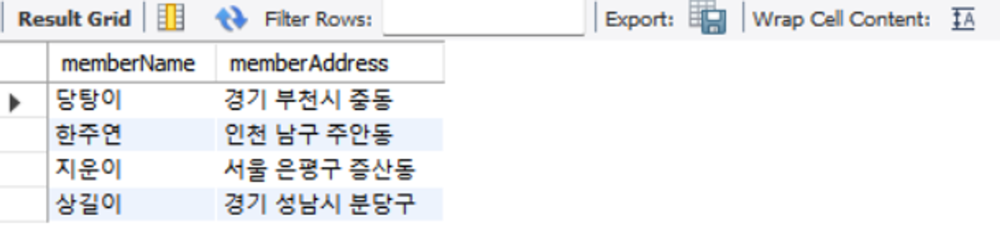
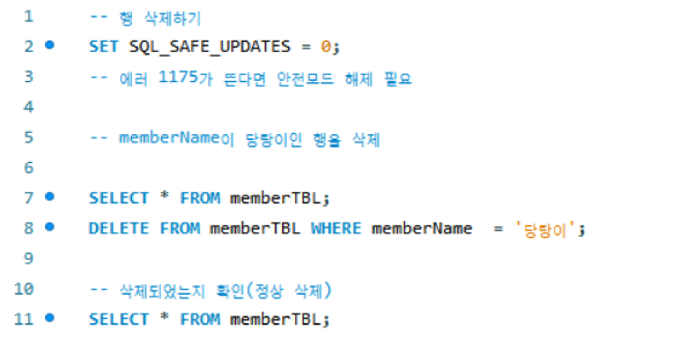

## 인덱스
1. 인덱스 없이 테이블 생성 후 작동 

- 실행 계획(Execution Plan) : Full Table Scan(전체 테이블 스캔)
   - 인덱스 없이 테이블 전체를 검색(Scan) 했다는 의미 

2. 인덱스 생성 후 작동

-  실행 계획(Execution Plan) : Non-Unique Key Lookup
    - 인덱스를 사용해서 결과를 도출했다는 의미    

📌 컴퓨터 입장에서는 인덱스를 활용해서 결과를 도출하는 것이 그렇지 않은 것보다 훨씬 덜 수고스럽게 작업   
    ➡ 즉, 큰 데이터를 다룰 때 시간적으로 덜 차지한다는 의미 

## 뷰테이블
-  뷰(View) : 가상 테이블을 의미 
-  사용자의 입장에서는 테이블과 동일하게 보이지만, 뷰는 실제 행 데이터를 가지고 있지 않음 
    - 실체는 없고, 진짜 테이블에 링크된 개념
  
- 결과
  
- 실제 데이터에서 memberID를 제외하고 두 열의 데이터만 출력

## 트리거
- 트리거: 테이블에 부착되어서 테이블에 INSERT나 UPDATE 또는 DELETE 작업이 발생되면 실행되는 코드 

   1. 테이블 데이터 삭제하기
     
   - error 1175 : 안전모드 실행 중 → 데이터 삭제가 안될 경우 1줄 처럼 입력

 ## 백업과 복원
 - 백업: 현재의 데이터베이스를 다른 매체에 보관하는 작업
 - 복원: 데이터베이스에 문제가 발생했을 대 다른 매체에 백업된 데이터를 이용해서 원상태로 돌려놓는 작업
 - export(백업)과 inport(복원)을 적절하게 사용하여 데이터를 보관할 수 있음 

