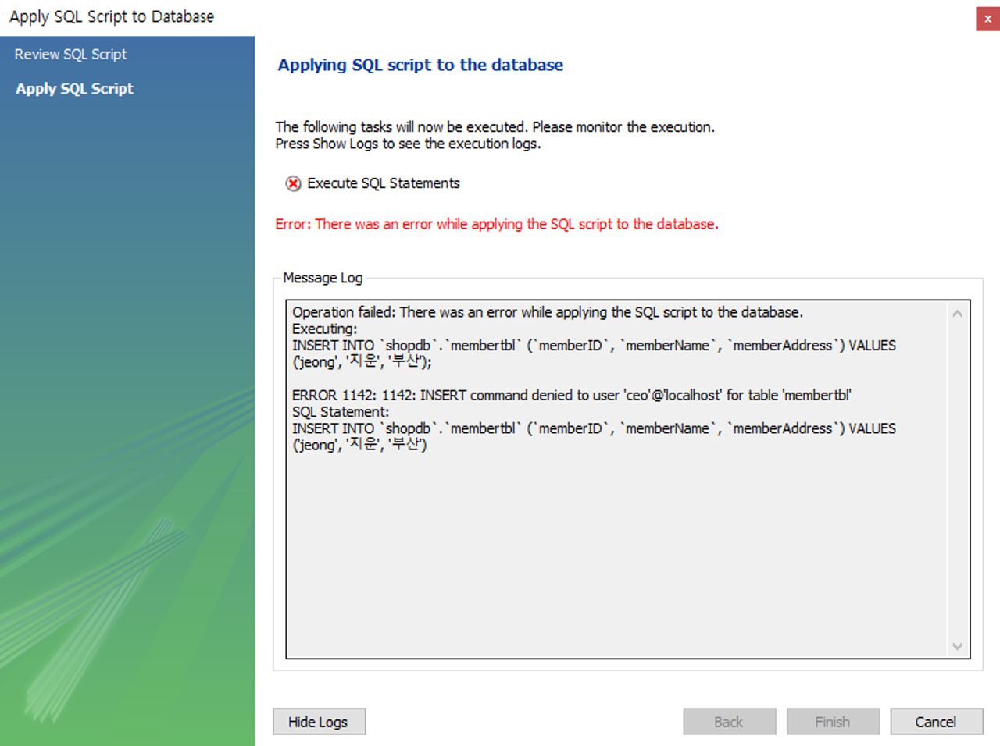
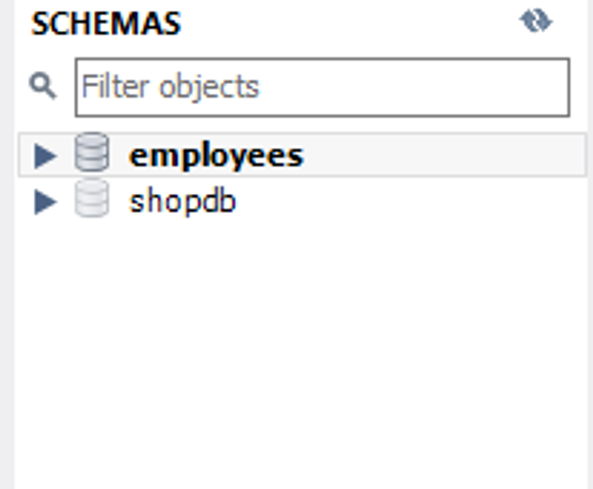

# ''' 24-04-02 강의 내용 '''

## 사용자 생성 및 권한
### 사용자 생성 및 권한 부여의 필요성
- 실무에서는 MySQL 데이터베이스를 혼자 사용하는 것이 아니라 다양한 사용자가 응용 프로그램에 접속해서 사용

### 사용자 생성 방법
- 방법 1. <u>Administraion</u> 사용
  - [Administration] ▶ [Users and Privileges] ▶ [Add Account] 클릭 후 생성

- 방법 2. 코드 작성  
   `CREATE USER director@'%' IDENTIFIED BY '1234';`
   - @ 뒤의 '%'는 모든 호스트를 가리킴 
   - IDENTIFIED BY '1234' : 비밀번호 설정


## DCL(Data Control Language)
- 데이터의 접근 권한을 제어하고 관리하는 명령어들의 집합
1. GRANT : 권한 부여
- 특정 사용자나 사용자 그룹에게 특정 데이터베이스(스키마)나 특정 테이블에서 명령할 수 있는 권한 부여
    ``` SQL
    GRANT SELECT ON database_name.table_name
    TO '사용자명'@'호스트명'
    ```
   ### 권한 부여 
    1. 모든 권한 부여 + 다른 사람에게 권한 부여 가능
   `GRANT ALL on *.* to director@'%' with GRANT OPTION;`
   - GRANT: 권한 부여
   - ALL : 모든 권한
   - to director@'%' : diretor에게 부여
   - with GRANT OPTION : 다른 사용자에게도 권한 부여 권한을 가짐 

     2. 모든 데이터베이스에 읽는 권한만 부여  
   `GRANT SELECT ON *.* TO ceo@'%';`
   - select만 가능함


- **데이터베이스를 수정하려면 오류 발생** 


    3. 테이블마다 다른 권한 부여  
        1) shopdb에 대해서는 CRUD 권한
            `GRANT SELECT, INSERT, UPDATE, DELETE ON shopdb.* TO staff@'%';`  
        2) employees에 대해서는 읽기만 가능
            `GRANT SELECT ON employees.* TO staff@'%';`

- **두 개의 테이블에 대해서만 권한을 부여했기 때문에 애초에 2개 테이블만 보여줌**
- emloyees 테이블에 대해서는 수정 불가(오류 발생)           

2. EVOKE : 권한 회수
  - 사용자에게 부여된 권한이 더이상 필요하지 않거나 보안 상의 이유로 권한 회수할 때 사용  
   ``` SQL
    REVOKE SELECT ON database_name.table_name
    FROM '사용자명'@'호스트명'
  ```
- 권한 부여나 회수는 DB의 보안과 직접적인 관련이 있으므로 신중히 할 것.     
- 일반적으로 사용자에게 최소한(필요한)의 권한만 부여하는 최소 권한 원칙을 따름  
   ➡ 데이터에 대한 무단 접근을 방지하고, 시스템 보안 수준을 높일 수 있음. 

    


